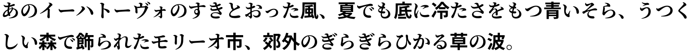

# antigoti パッケージ

ひらがな・カタカナに明朝体、漢字にゴシック体を当てることでアンチゴチを作成する LaTeX パッケージです。



## 注意

antigoti パッケージでは現在、2 つの利用状況が想定されています。

- アンチゴチする文章に LaTeX コマンドが入らずただの文章のみが入る
- アンチゴチする文章に LaTeX コマンドが入る

前者の場合、LaTeX 文書を作成する知識があれば良いです。

後者の場合、expl3 および TeX 言語の知識を必要とする場合があります。

## 要件

- LuaLaTeX＋luatexja
- expl3

## パッケージ読み込み

```latex
\usepackage{antigoti}
```

### パッケージオプション

| オプション | 値           | 説明                        |
| :--------: | ------------ | --------------------------- |
|    `bf`    | boolean      | 全体に `\bfseries` を課すか |
|   `font`   | フォント命令 | 各文字のフォント命令の指定  |
|  `color`   | 色           | 色を指定                    |

`bf` を使用する場合は、luatexja-preset パッケージの `deluxe` オプションを有効にして多書体化してください。

`font`・`color` オプションは次のように `kana`、`kanji`、`latin`、`other` の 4 つの値それぞれにフォント命令や色を指定します。

```latex
\usepackage[
  font =
  {
    other = \sffamily,
  },
  color =
  {
    kana = red,
    kanji = blue,
  }
]{antigoti}
```

ただし、`color` で指定できる色は `black`、`white`、`red`、`green`、`blue`、`cyan`、`magenta`、`yellow` の 8 つです。もしも自由に色を指定したい場合は `\color_set:nn` を構成してください。

## 使い方

antigoti パッケージが提供するコマンドは 1 つです。

```latex
\antigoti{〈文章〉}
```

パッケージオプションと同様のオプションを利用できます。

### アンチゴチする文章に LaTeX コマンドが入る場合

次のような LaTeX コマンドを含めてアンチゴチする場合は注意が必要です。

```latex
\antigoti{\ref{hoge}のように相互参照する文章もアンチゴチしたい}
```

antigoti パッケージでは、このような LaTeX コマンドや `{}` で囲われた部分を item（l3tl モジュールによる）として解釈します。また、上の例では `\ref` と `{hoge}` の 2 item として解釈し、それぞれを別個に扱います。そのため、相互参照がうまく出来ません。

2 つ以上の item に解釈されるような部分をアンチゴチするには、`{}` で囲ってください。これによって、1 つの item として解釈されるため相互参照は上手くいきます。

```latex
\antigoti{{\ref{hoge}}のように相互参照する文章もアンチゴチしたい}
```

ただし、この部分を展開してそれぞれの文字にフォント命令を与えるように構成していないため、そのまま出力されます。

## antigoti パッケージに関する記事

https://qiita.com/Yarakashi_Kikohshi/items/604c1619c53903f929ac

## LICENSE

MIT License
